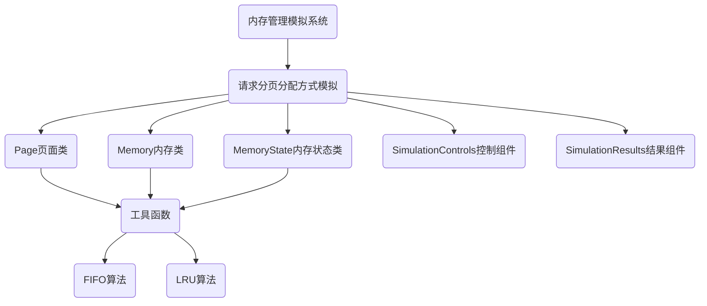

# 内存管理模拟系统

## 1 项目介绍

### 1.1 项目简介

**Memory Management: Demand Paging Allocation Method Simulation**

**内存管理项目：请求分页分配方式模拟**

本内存管理项目通过模拟实际的页面管理机制来理解和掌握操作系统中内存管理的基本原理和技术。项目主要实现了请求分页分配方式的模拟，通过可视化的方式展示页面置换算法的工作过程和性能差异。

#### 1.1.1 请求分页分配方式模拟简介

这部分模拟是为了展示和学习请求分页管理系统在操作系统中的实际运作。假设每个页面可存放10条指令，分配给一个作业的内存块为4。这里将模拟一个作业的执行过程，该作业由320条指令组成，其地址空间为32页。初始时，所有页面未加载到内存中。

* **页面调度**：在作业执行过程中，若访问的指令已在内存中，则直接访问；若不在内存中，则发生缺页，此时将页面调入内存。若内存块已满，需要根据页面置换算法替换一页。
* **页面置换算法**：选择先进先出（FIFO）算法和最近最少使用（LRU）算法。FIFO算法根据页面调入内存的顺序进行置换，而LRU算法基于页面的访问频率进行置换，优先替换最少使用的页面。
* **指令访问顺序**：作业中指令访问顺序按照程序局部性原理生成，包括顺序局部性、后向局部性和前向局部性，以模拟实际中的程序访问模式。

### 1.2 项目目的

#### 1.2.1 请求分页分配方式模拟目的

* **理解页面管理机制**：模拟一个作业的执行过程中的页面调度和置换，使用户理解页表、地址转换以及页面调入/调出的工作原理。
* **掌握页面置换算法**：实现并比较FIFO和LRU两种不同的页面置换算法，用户可以深入了解这些算法如何影响作业的执行效率和系统的整体性能。
* **评估缺页率和性能**：通过计算作业执行过程中的缺页率，用户将学会如何分析和评估内存管理策略的效率。

#### 1.2.2 综合目的

* **培养实际问题解决能力**：通过模拟真实世界的内存管理问题，提高解决复杂系统问题的能力。
* **增强编程和算法设计技能**：实际编写和优化内存管理算法，提升编程能力及算法设计技能。
* **提高系统思维能力**：理解操作系统中各个组件如何协同工作，加深对系统架构的整体理解。

### 1.3 项目组成

* `/src`
  代码文件

  * `App.vue`
  父组件，整个应用的主入口

  * `classes.js`
  核心类定义文件，包含Page、Memory和MemoryState类

  * `main.js`
  前端应用程序入口

  * `utils.js`
  工具函数，包含算法实现和指令序列生成

  * `/components`
  组件目录

    * `SimulationControls.vue`
    模拟控制面板组件，提供算法选择和操作按钮

    * `SimulationResults.vue`
    模拟结果展示组件，显示模拟过程和性能指标

  * `/services`
    服务目录

    * `simulationService.js`
    模拟服务，封装了算法运行和结果处理

* `index.html`
首页入口

* `package.json`
项目依赖配置文件

* `vite.config.js`
Vite构建工具配置文件

### 1.4 项目运行

#### 1.4.1 安装依赖

```bash
npm install
```

#### 1.4.2 开发模式运行

```bash
npm run dev
```

## 2 开发环境

### 2.1 开发环境概述

本项目的开发环境如下：

* 开发环境
  * Windows 11
* 开发软件
  * Visual Studio Code
* 开发框架
  * Vue 3
  * Element Plus
* 开发语言
  * HTML
  * CSS
  * JavaScript

### 3.1 程序主体架构设计



项目主要实现了请求分页分配方式的模拟。主要涉及的类和组件如下：

#### 3.1.1 请求分页分配方式模拟

* **`Page` 页面类**：这个类代表内存中的一页，每页存放10条指令。该类提供基本的页面信息，例如页面编号和存储的指令。

* **`Memory` 内存类**：该类模拟实际的内存，其中包含4个页面框架和一个方法用于确定页面是否已经加载到内存中。此类支持两种页面置换算法：先进先出（FIFO）和最近最少使用（LRU）。

* **`MemoryState` 内存状态类**：用于记录内存操作的日志。它记录了每次指令访问的详细信息，包括页面是否发生了缺页，哪个页面被调入或调出。

* **`SimulationControls` 控制组件**：提供用户界面，允许用户选择要运行的页面置换算法（FIFO或LRU）并启动模拟。

* **`SimulationResults` 结果组件**：显示模拟结果，包括缺页数、缺页率、执行时间，以及详细的内存状态变化记录。

#### 3.1.2 工具函数

工具函数是整个项目中用于支持各类功能的函数集合，如指令序列的生成、模拟执行过程中的页面调度和置换等。这些函数与页面类、内存类和内存状态类紧密协作，共同完成请求分页分配方式模拟的核心功能。

```javascript
// 生成指令序列
function generateInstructionSequence() {...}

// 模拟 FIFO 置换算法
export function fifoSimulation() {...}

// 模拟 LRU 置换算法
export function lruSimulation() {...}
```

### 3.2 核心数据结构设计

#### 3.2.1 Page类

Page类代表一个内存页面，包含以下属性和方法：

```javascript
export class Page {
    constructor(id) {
        this.id = id
        this.instructions = Array.from({length: 10}, (_, i) => id * 10 + i)
    }
}
```

#### 3.2.2 Memory类

Memory类代表物理内存，包含以下属性和方法：

```javascript
export class Memory {
    constructor(size, method) {
        this.size = size         
        this.method = method     
        this.pages = []          
        this.lastUsedTime = Array(4).fill(0)  
    }

    hasInstruction(instruction, time = 0) {
        const pageIndex = this.pages.findIndex(page => 
            page && page.instructions.includes(instruction)
        )
        
        if (pageIndex !== -1) {
            if (this.method === 'LRU') {
                this.lastUsedTime[pageIndex] = time
            }
            return true
        }
        return false
    }
}
```

#### 3.2.3 MemoryState类

MemoryState类用于记录内存操作的状态和日志：

```javascript
export class MemoryState {
    constructor() {
        this.logs = []  
    }

    addLog(id, instructionId, memory, isPageFault, insertedBlock, removedPage) {
        const logEntry = {
            id,                 
            instructionId,      
            pages: memory.pages.map(page => page ? page.id : '-'),  
            isPageFault,       
            insertedBlock: insertedBlock !== null ? insertedBlock + 1 : '-', 
            removedPage: removedPage !== null ? removedPage : '-'   
        }
        this.logs.push(logEntry)
    }
}
```

### 3.3 页面置换算法设计

#### 3.3.1 FIFO（先进先出）算法

FIFO算法按照页面进入内存的顺序进行置换，最早进入内存的页面最先被置换出去。实现如下：

```javascript
export function fifoSimulation() {
    const sim = initializeSimulation('FIFO')
    let index = 0
    
    for (const instruction of sim.instructions) {
        sim.count++
        const pageId = Math.floor(instruction / 10)
        
        if (!sim.memory.hasInstruction(instruction)) {
            const removedPage = sim.memory.pages.length >= sim.memory.size ? 
                sim.memory.pages[index].id : null
                
            sim.memory.pages[index] = sim.pages[pageId]
            sim.memory.lastUsedTime[index] = sim.count
            sim.pageFaults++
            
            sim.log.addLog(sim.count, instruction, sim.memory, true, index, removedPage)
            
            index = (index + 1) % MEMORY_SIZE
        } else {
            sim.log.addLog(sim.count, instruction, sim.memory, false, null, null)
        }
    }
    
    return {
        pageFaults: sim.pageFaults, 
        pageFaultRate: calculatePageFaultRate(sim.pageFaults), 
        logs: sim.log.logs
    }
}
```

#### 3.3.2 LRU（最近最少使用）算法

LRU算法根据页面的访问时间进行置换，最长时间未被访问的页面将被置换出去。实现如下：

```javascript
export function lruSimulation() {
    const sim = initializeSimulation('LRU')
    
    for (const instruction of sim.instructions) {
        sim.count++
        const pageId = Math.floor(instruction / 10)
        
        if (!sim.memory.hasInstruction(instruction, sim.count)) {
            let index = sim.memory.pages.findIndex(page => page === undefined)
            
            if (index === -1) {
                index = sim.memory.lastUsedTime.indexOf(Math.min(...sim.memory.lastUsedTime))
            }
            
            const removedPage = sim.memory.pages[index] ? sim.memory.pages[index].id : null
            
            sim.memory.pages[index] = sim.pages[pageId]
            sim.memory.lastUsedTime[index] = sim.count
            sim.pageFaults++
            
            sim.log.addLog(sim.count, instruction, sim.memory, true, index, removedPage)
        } else {
            sim.log.addLog(sim.count, instruction, sim.memory, false, null, null)
        }
    }
    
    return {
        pageFaults: sim.pageFaults, 
        pageFaultRate: calculatePageFaultRate(sim.pageFaults), 
        logs: sim.log.logs
    }
}
```

### 3.4 指令序列生成设计

指令序列的生成遵循程序局部性原理，包括顺序局部性、后向局部性和前向局部性：

```javascript
function generateInstructionSequence() {
    const executionOrder = []
    let count = 0
    
    while (count < TOTAL_INSTRUCTIONS) {
        const m = Math.floor(Math.random() * TOTAL_INSTRUCTIONS)
        executionOrder.push(m)
        count++
        
        if (m + 1 < TOTAL_INSTRUCTIONS && count < TOTAL_INSTRUCTIONS) {
            executionOrder.push(m + 1)
            count++
        }
        
        if (m > 0 && count < TOTAL_INSTRUCTIONS) {
            const m1 = Math.floor(Math.random() * m)
            executionOrder.push(m1)
            count++
            
            if (m1 + 1 < m && count < TOTAL_INSTRUCTIONS) {
                executionOrder.push(m1 + 1)
                count++
            }
        }
        
        if (m + 2 < TOTAL_INSTRUCTIONS && count < TOTAL_INSTRUCTIONS) {
            const m2 = m + 2 + Math.floor(Math.random() * (TOTAL_INSTRUCTIONS - 2 - m))
            executionOrder.push(m2)
            count++
            
            if (m2 + 1 < TOTAL_INSTRUCTIONS && count < TOTAL_INSTRUCTIONS) {
                executionOrder.push(m2 + 1)
                count++
            }
        }
    }
    
    if (executionOrder.length > TOTAL_INSTRUCTIONS) {
        executionOrder.pop()
    }
    
    return executionOrder
}
```

## 4 用户界面设计

### 4.1 整体布局

项目采用响应式设计，适配不同屏幕尺寸的设备。整体布局包括：

1. **顶部标题栏**：显示项目名称和开发者信息
2. **左侧控制面板**：提供算法选择和操作按钮
3. **右侧结果展示区**：显示模拟结果和详细数据
4. **底部页脚**：显示版权信息

### 4.2 控制面板设计

控制面板提供以下功能：

1. **算法选择按钮**：
   - 模拟先进先出（FIFO）算法
   - 模拟最近最少使用（LRU）算法
   - 重置模拟

2. **算法说明**：提供关于FIFO和LRU算法的简要说明

### 4.3 结果展示区设计

结果展示区包括：

1. **性能指标卡片**：
   - 缺页数
   - 缺页率
   - 执行时间
2. **内存状态表格**：
   - 操作编号
   - 指令代号
   - 内存块状态（4个内存块）
   - 是否发生缺页
   - 页面放入位置
   - 被换出的页面


## 5 算法分析与比较

### 5.1 FIFO算法分析

先进先出（FIFO）算法是一种最简单的页面置换算法，它选择在内存中停留时间最长的页面进行置换。

**优点**：
- 实现简单，易于理解
- 不需要记录页面的访问历史
- 管理开销小

**缺点**：
- 不考虑页面的访问频率，可能会置换出经常使用的页面
- 可能出现Belady异常（增加物理页面数反而增加缺页率）
- 性能相对较差，尤其是在程序具有较强局部性的情况下

### 5.2 LRU算法分析

最近最少使用（LRU）算法基于程序局部性原理，选择最长时间未被访问的页面进行置换。

**优点**：
- 较好地反映了程序的局部性原理
- 在大多数情况下性能优于FIFO
- 不会出现Belady异常

**缺点**：
- 实现复杂，需要记录每个页面的访问时间
- 管理开销较大
- 在某些特殊访问模式下性能可能不佳

### 5.3 算法性能比较

通过对两种算法在相同指令序列下的模拟，可以比较它们的性能差异：

1. **缺页率**：LRU算法通常比FIFO算法具有更低的缺页率，特别是在指令序列具有较强局部性的情况下。

2. **执行效率**：虽然LRU算法在缺页率方面表现更好，但由于其实现复杂度更高，实际执行时间可能比FIFO更长。

3. **适用场景**：
   - FIFO适用于页面访问模式随机或页面大小较大的情况
   - LRU适用于具有较强局部性特征的程序

## 6 总结与展望

### 6.1 项目总结

本项目通过模拟请求分页分配方式，直观展示了页面置换算法的工作过程和性能差异。通过实现FIFO和LRU两种经典算法，用户可以深入理解操作系统内存管理的核心概念和技术。项目采用现代前端技术栈，提供了友好的用户界面和实时的性能指标展示，使学习过程更加直观和高效。

### 6.2 未来展望

未来可以对项目进行以下扩展和改进：

1. **增加更多页面置换算法**：如Clock算法、改进型Clock算法、最佳置换（OPT）算法等。

2. **支持自定义参数**：允许用户自定义内存块数量、页面大小、指令序列等参数。

3. **可视化增强**：添加动态图表和动画，更直观地展示页面置换过程。

4. **性能分析工具**：提供更详细的算法性能分析和比较工具。

5. **集成动态分区分配方式模拟**：完善为完整的内存管理模拟系统。

## 7 参考资料

1. Vue.js官方文档：https://vuejs.org/guide/introduction.html
2. Element Plus组件库：https://element-plus.org/

## 8 开发者信息

- 学号：2351883
- 姓名：陈奕名
- 课程：操作系统课程设计

## 9 许可证

© 2025 操作系统课程设计 